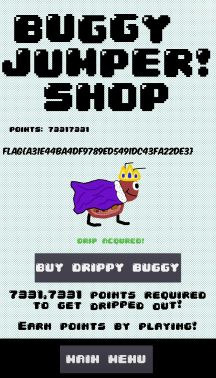

## mobile/buggy_jumper

### Part 1
Buggy Jumper is a new mobile game that can be enjoyable for both gamers and hackers! There's a lot going on, can you get some of game's source code to see whats happening behind the scenes?

### Part 2
Buggy really wants the drip in the shop... Can you buy it for them?

**Given:** com.nahamcon2024.buggy_jumper.apk

## Solution

Static analysis of APK can be done using https://mobsf.live/. Static analysis reveals that the game is made by [godot engine](https://godotengine.org/). Luckily, we have toolkit for reverse engineeing godot games - gdre_tools (https://github.com/bruvzg/gdsdecomp).

The game,


### Part 1

To get godot source, we load the APK into gdre_tools. The decompiled scripts folder contains a `flag.gd` script with flag.


### Part 2

The decompiled scripts folder contains a `shop.gd` script.


The game requires us to get 73317331 points to reveal the flag. 


While this challenge can be solved by other ways such as capturing network traffic, we can also directly edit the score in app's local storage. It is fairly simple in a rooted device or emulator. 

In android shell,
```
r9s:/data/data/com.nahamcon2024.buggyjump # cat files/saved_value.dat
8
r9s:/data/data/com.nahamcon2024.buggyjump # echo "73317331" > files/saved_value.dat
r9s:/data/data/com.nahamcon2024.buggyjump # cat files/saved_value.dat
73317331
r9s:/data/data/com.nahamcon2024.buggyjump #
```

Now, we can get the flag from shop.

