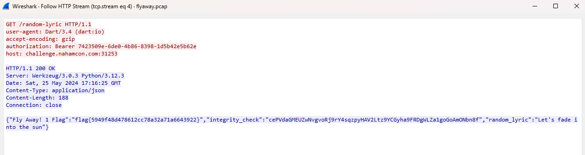

## mobile/fly_away

### Part 1
Lenny Kravitz lovers, this new app cleverly named "Fly Away!" can give you random lines from one of his most popular songs. Can you figure out how the songs are being sent to the app?

**Given:** com.nahamcon2024.flyaway.apk

## Solution

Static analysis of APK can be done using https://mobsf.live/. The static analysis reveals that the app is made using [Flutter](https://flutter.dev/) which complicates the reverse engineering a bit.

  
The app shows a random quote on button click.

### Part 1
The challenge description hints to check the network traffic of the app. 
[Burp suite's proxy](https://portswigger.net/burp/documentation/desktop/tools/proxy) can be used to inspect the network traffic. However that didn't show any traffic from flyaway app. Turns out flutter does not respect network's HTTP proxy settings.

Flutter app's code is compiled into an ELF file `libapp.so`. We can look for URLs used in it using `strings` command.
```
$ unzip com.nahamcon2024.flyaway.apk
$ strings lib/arm64-v8a/libapp.so | grep http://
http://challenge.nahamcon.com:31253/random-lyric
```

Luckily, the app uses unsecure HTTP. A simple `tcpdump` should suffice to look into the HTTP payload. 

Launch `tcpdump` on android's wifi interface
```
$ adb shell
r9s:/ $ su
r9s:/ # cd /data/tcpdump/
r9s:/data/tcpdump # ls
tcpdump
r9s:/data/tcpdump # ./tcpdump -i wlan0 -w /storage/emulated/0/Download/flyaway.pcap
tcpdump: listening on wlan0, link-type EN10MB (Ethernet), snapshot length 262144 bytes
^C163 packets captured
174 packets received by filter
0 packets dropped by kernel
```

The flag is found in the HTTP response that fetches quotes.

