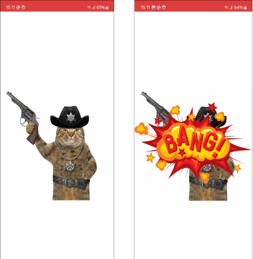
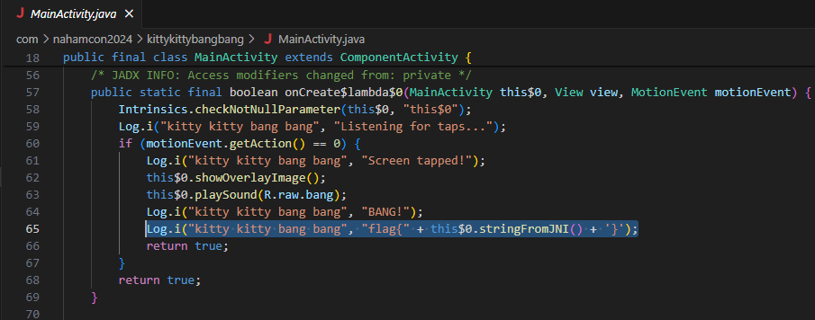
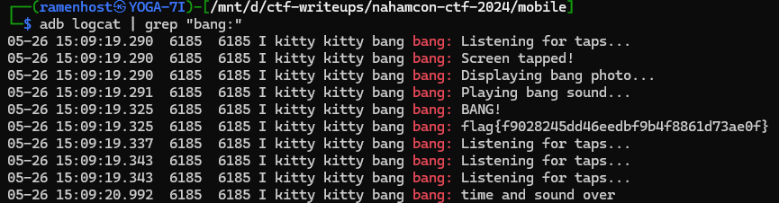

## mobile/kitty_kitty_bang_bang

I found a cool android app to play with a cowboy cat! There's has to be more going on with the app I can't see on my screen...   
**Given:** com.nahamcon2024.kittykittybangbang.apk

## Solution

Static analysis of APK can be done using https://mobsf.live/. 

The application shows an image of cowboy cat. On tapping screen it plays a sound and shows an overlay image.

We can download decompiled java from MobSF static analysis results. We quickly see this log in decompiled Java.

The flag is logged when kitty is tapped on screen. Logs from all applications can be read using `adb logcat`. All we need is to run the applcation, tap the screen and read logs.

