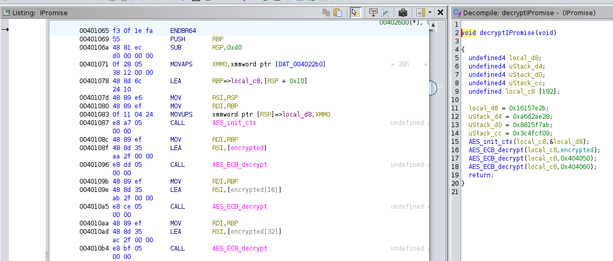

## rev/ipromise

Instead of making the next IPhone, I made this challenge. I do make a truthful promise though...  
**Given:** iPromise

## Solution

Once we load the given ELF in ghidra, we can quickly find this fucntion that does a AES-ECB decrypt of hard-coded data with hard-coded key.

We can copy the key from `local_d8` stack variable and encrypted data from `0x00404040`. [CyberChef](https://gchq.github.io/CyberChef/) can be used to decrypt and get the flag.