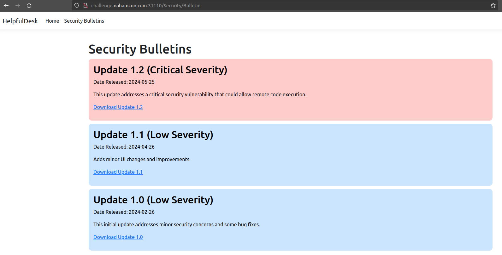
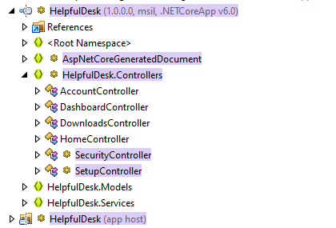
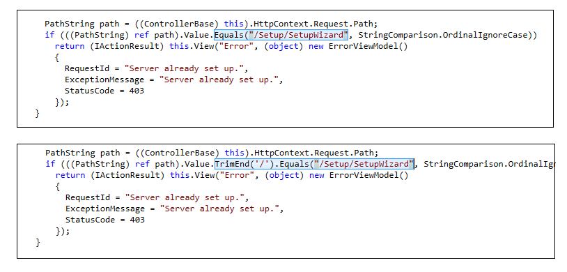
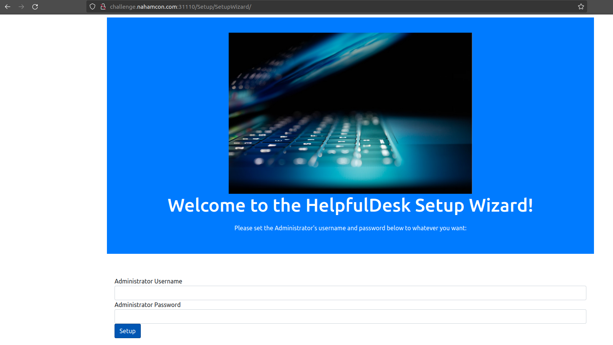

## web/helpfuldesk

HelpfulDesk is the go-to solution for small and medium businesses who need remote monitoring and management. Last night, HelpfulDesk released a security bulletin urging everyone to patch to the latest patch level. They were scarce on the details, but I bet that can't be good...

Press the Start button on the top-right to begin this challenge.
Connect with:
http://challenge.nahamcon.com:<port>

## Solution

The website has a login page and security bulletins page. The website currently runs version 1.1 of helpfuldesk as shown on footer.

Now, we know that the current version has RCE. The vulnerability can be found by analyzing difference between version 1.1 and 1.2. The zip files contain .NET application for which we can use [dotpeek](https://www.jetbrains.com/decompiler/) tool to find the diff. After loading the downloaded zip files in dotpeek, we can see the fixed vulnerability as shown in below image.

The SetupController allows configuring the server with new credentials. Once configured, it must block the setup endpoint. However, the fix shows that by adding a trailing "/", we can bypass this restriction and setup the server again.

We can override the credentials here and login to access the flag.
