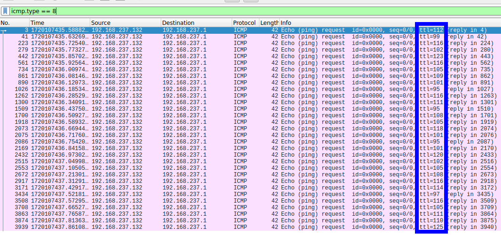

## forensics/simple-exfiltration

We've got some reports about information being sent out of our network. Can you figure out what message was sent out.

**Given:** `exfiltration_activity_pctf_challenge.pcapng`

## Solution

After analyzing the pcap file in Wireshark, we can see that the ICMP ping packets `ttl` field was used as a covert channel sending one byte per ICMP request. 



We can extract the data from the `ttl` field and convert it to ASCII to get the flag.

```bash
tshark -r exfiltration_activity_pctf_challenge.pcapng -Y "icmp.type == 8" -Tfields -e ip.ttl | awk '{printf "%c", $1} END{printf "\n"}'
```

## Flag
```bash
ramenhost@ctf$ ./solve.sh 
pctf{time_to_live_exfiltration}
```