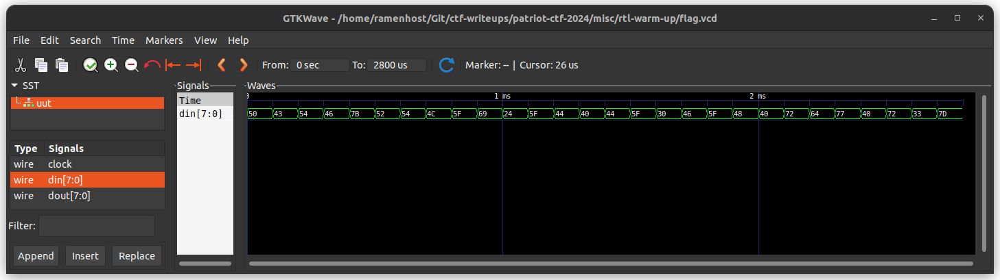

## misc/rtl-warm-up

Let's Warm up. Spartan's wanted to create their own ASIC, to secure doors. One of the spy was able to extract the simulation file, can you find the password to the door?
Note: The spaces are _

**Given:** `flag.vcd`

## Solution

I opened up the `flag.vcd` file in `GTKWave` and found the following signal.

Converting the hex values to ASCII gives the flag.

