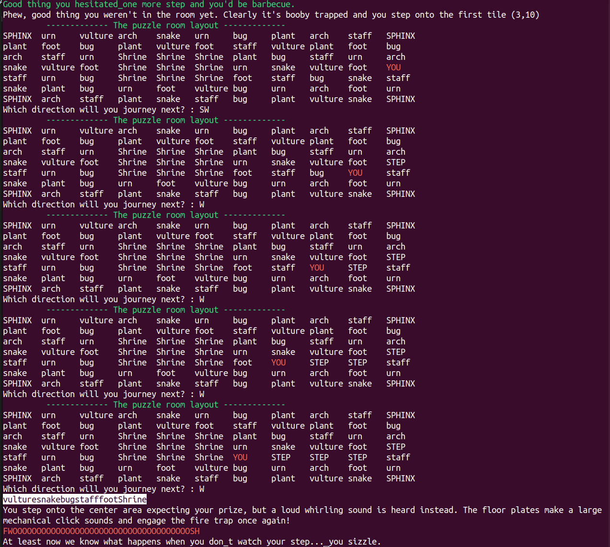

## rev/puzzle-room

As you delve deeper into the tomb in search of answers, you stumble upon a puzzle room, its floor entirely covered in pressure plates. The warnings of the great necromancer, who hid his treasure here, suggest that one wrong step could lead to your doom.

You enter from the center of the eastern wall. Although you suspect you’re missing a crucial clue to guide your steps, you’re confident that everything you need to safely navigate the traps is already within reach.

At the center of the room lies the key to venturing further into the tomb, along with the promise of powerful treasures to aid you on your quest. Can you find the path, avoid the traps, and claim the treasure (flag) on the central platform?

**Given:** `puzzle_room.py`

## Analysis
The given file `puzzle-room.py` contains a game where the player has to navigate through a grid of tiles. The player starts at the center of the eastern wall and has to reach the center of the room. The player can only move to adjacent tiles and can only move to a tile if the tile name is not already in the history. The player has to reach the center of the room in 4 or more steps.



When the player reaches the center of the room, the flag is decrypted using the key generated from the history of tiles visited by the player. While there could be many possible paths to reach the center of the room, the flag is decrypted only if the history of tiles visited by the player is correct.

## Solution

We can solve this problem by brute-forcing the tiles visited by the player. We know that the player starts at "vulture" and ends at "Shrine". We can remove these tiles from the list of tiles to be visited. We can then brute-force all possible paths that can be taken by a player and try to decrypt the flag using the key generated from the history of tiles visited.

### solve.py

```python
import base64
import hashlib
from Crypto import Random
from Crypto.Cipher import AES
import itertools

# copy AESCipher class from puzzle-room.py
# class AESCipher(object):
#     def __init__(self, key):
#         self.bs = AES.block_size
#         ....
#         ....

# all words from puzzle-room.py grid variable
wordlist = ["SPHINX","urn","vulture","arch","snake","urn","bug","plant","arch","staff","SPHINX","plant","foot","bug","plant",
            "vulture","foot","staff","vulture","plant","foot","bug","arch","staff","urn","Shrine","Shrine","Shrine","plant",
            "bug","staff","urn","arch","snake","vulture","foot","Shrine","Shrine","Shrine","urn","snake","vulture","foot","vulture",
            "staff","urn","bug","Shrine","Shrine","Shrine","foot","staff","bug","snake","staff","snake","plant","bug","urn","foot",
            "vulture","bug","urn","arch","foot","urn","SPHINX","arch","staff","plant","snake","staff","bug","plant","vulture","snake","SPHINX",
]

wordlist = set(wordlist) # history cannot have tiles with same name
wordlist.remove("Shrine") # end
wordlist.remove("SPHINX") # corners not allowed
wordlist.remove("vulture") # start

# enc_flag from puzzle-room.py try_get_tile()
enc_flag = b"FFxxg1OK5sykNlpDI+YF2cqF/tDem3LuWEZRR1bKmfVwzHsOkm+0O4wDxaM8MGFxUsiR7QOv/p904UiSBgyVkhD126VNlNqc8zNjSxgoOgs="

# we start at "vulture" and end at "Shrine". Brute force tiles in-between
# 4 or more steps needs to reach Shrine
for n in range(4, len(wordlist) + 1):
    for perm in itertools.permutations(wordlist, n):
        brute = ''.join(perm)
        key = "vulture" + brute + "Shrine"
        obj = AESCipher(key)
        try:
            dec_flag = obj.decrypt(enc_flag)
            if "pctf" in dec_flag:
                print(dec_flag)
                exit(0)
        except Exception:
            continue
```


## Flag
```bash
ramenhost@ctf$ python3 solve.py 
pctf{Did_you_guess_it_or_apply_graph_algorithms?}
```
