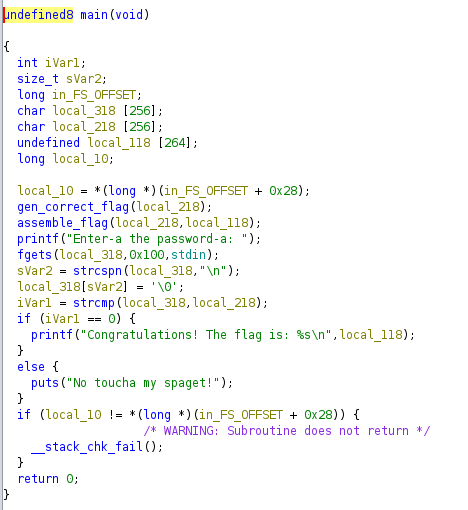

## rev/revioli-revioli-give-me-the-formeoli

Can you unlock the secret formula?

**Given:** `revioli`

## Analysis

The given file `revioli` is a 64-bit ELF executable. It asks for a password from the user.
```bash
ramenhost@ctf$ ./revioli 
Enter-a the password-a: Idontknow
No toucha my spaget!
```

The Ghidra decompilation of the main function is shown below.


## Solution

The executable reads a password from the user and compares it with a generated string. If the strings match, the executable prints the flag. 
Instead of analyzing the password generation logic (`gen_correct_flag()`and `assemble_flag()`), we can use `gdb` to get the second argument of `strcmp()` call. According to x86-64 calling convention, the second argument is stored in `rsi` register.

### solve.gdb
```
break main
run
break strcmp
continue
printf "%s\n", $rsi
quit
```
run using `gdb -quiet -x solve.gdb ./revioli </dev/null` to get the correct password.

## Flag
```bash
ramenhost@ctf$ gdb -quiet -x solve.gdb ./revioli </dev/null 2>/dev/null | tail -n1 | ./revioli 
Enter-a the password-a: Congratulations! The flag is: PCTF{ITALY_01123581321345589144233377
```
